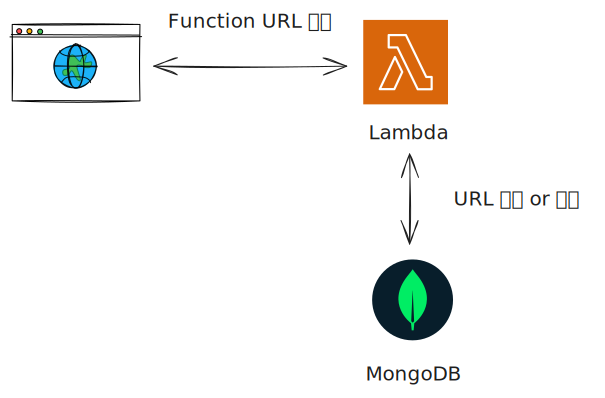

# URL Shortener

Twitter Snowflake ID와 Base62 인코딩을 사용한 URL 단축 서비스

## Architecture Diagram



## Architecture

- **Lambda Function (Go)**: URL 단축 및 리다이렉션 로직
- **MongoDB**: URL 매핑 데이터 저장
- **Lambda Function URL**: HTTP 엔드포인트

## API Endpoints

### POST /shorten

URL을 단축합니다.

**Request:**
```bash
curl -X POST <FUNCTION_URL>/shorten \
  -H "Content-Type: application/json" \
  -d '{"url": "https://example.com/very/long/url"}'
```

**Response:**
```json
{
  "shortUrl": "2aB3cD"
}
```

### GET /{shortUrl}

단축된 URL을 원본 URL로 리다이렉션합니다.

**Request:**
```bash
curl -L <FUNCTION_URL>/2aB3cD
```

**Response:**
- 302 Found (Location 헤더에 원본 URL)
- 404 Not Found (존재하지 않는 short URL)

## Deployment

### 1. Lambda 함수 빌드

```bash
cd lambda
go mod download
make build
cd ..
```

### 2. Pulumi 설정

```bash
pulumi config set mongodbUri --secret "<mongodb_uri>"
```

### 3. 인프라 배포

```bash
pulumi up
```

배포 후 `functionUrlEndpoint` 출력값을 확인

## Implementation Details

### Snowflake ID

- 64비트 정수 기반 분산 ID 생성
- 타임스탬프 + 머신 ID + 시퀀스 번호
- 시간 순서 보장 및 충돌 방지

### Base62 Encoding

- 0-9, A-Z, a-z (62자)
- Snowflake ID를 짧은 문자열로 변환
- URL-safe 문자만 사용

### MongoDB Schema

```javascript
{
  _id: <snowflake_id>,           // int64
  short_url: "<base62_encoded>", // string
  long_url: "<original_url>"     // string
}
```

인덱스: `short_url` (unique)

## Tech Stack

- **Lambda Runtime**: Go (provided.al2023)
- **Infrastructure**: Pulumi (TypeScript)
- **Database**: MongoDB Atlas
