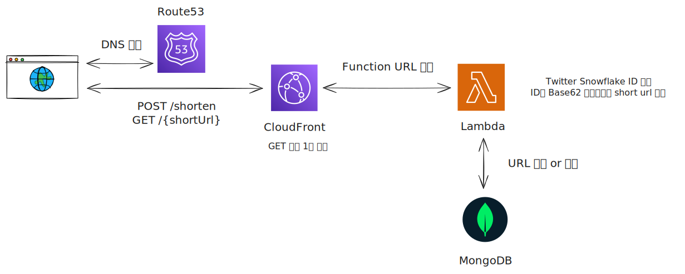

# URL Shortener

Twitter Snowflake ID와 Base62 인코딩을 사용한 URL 단축 서비스

## Architecture Diagram



## Architecture

- **Route53**: DNS 관리 및 도메인 라우팅
- **ACM**: SSL/TLS 인증서 (HTTPS 지원)
- **CloudFront**: 글로벌 CDN (캐싱으로 성능 향상)
- **Lambda Function (Go)**: URL 단축 및 리다이렉션 로직
- **MongoDB**: URL 매핑 데이터 저장
- **Lambda Function URL**: Origin 서버

**캐싱 전략:**

- GET 요청 (redirect): 기본 1분, 최대 1시간 캐싱
- POST 요청 (생성): 캐싱 없음

## API Endpoints

### POST /shorten

URL을 단축합니다.

**Request:**

```bash
curl -X POST <FUNCTION_URL>/shorten \
  -H "Content-Type: application/json" \
  -d '{"url": "https://example.com/very/long/url"}'
```

**Response:**

```json
{
  "shortUrl": "2aB3cD"
}
```

### GET /{shortUrl}

단축된 URL을 원본 URL로 리다이렉션합니다.

**Request:**

```bash
curl -L <FUNCTION_URL>/2aB3cD
```

**Response:**

- 302 Found (Location 헤더에 원본 URL)
- 404 Not Found (존재하지 않는 short URL)

## Deployment

### 1. Lambda 함수 테스트 및 빌드

```bash
cd lambda
go mod download

# 테스트 실행
make test

# 커버리지 확인
make test-coverage

# 빌드
make build
cd ..
```

### 2. Pulumi 설정

```bash
pulumi config set mongodbUri --secret "<mongodb_uri>"
pulumi config set enableCustomDomain false
```

| Key                  | Type    | Required | Default | Description                                         |
| -------------------- | ------- | -------- | ------- | --------------------------------------------------- |
| `mongodbUri`         | Secret  | Yes      | -       | MongoDB 연결 URI                                    |
| `enableCustomDomain` | Boolean | No       | `false` | CloudFront + SSL 활성화<br>Route53 배포 이후 활성화 |

### 3. 인프라 배포

```bash
pulumi up
```

배포 후 `functionUrlEndpoint` 출력값 확인

### 4. 커스텀 도메인 설정 (w/GoDaddy)

**4-1. 초기 배포 (Route53 Hosted Zone 생성)**

```bash
pulumi up
```

**4-2. GoDaddy 네임서버 변경**

Pulumi 출력에서 `nameServers` 값 확인:

```bash
pulumi stack output nameServers
```

GoDaddy에서 네임서버 변경:

1. GoDaddy 도메인 관리 페이지 접속
2. 도메인 선택 → DNS → 네임서버
3. "네임서버 변경" 클릭
4. "커스텀 네임서버 사용" 선택
5. Pulumi 출력의 `nameServers` 값 4개를 입력
6. 저장 (DNS 전파까지 최대 48시간 소요, 보통 1-2시간)

DNS 전파 확인:

```bash
dig <custom_domain> NS +short
```

출력이 `ns-xxxx.awsdns-xx.org` 형식으로 나오면 전파 완료

**4-3. CloudFront 및 SSL 인증서 배포**

DNS 전파가 완료되면 커스텀 도메인을 활성화:

```bash
pulumi config set enableCustomDomain true
pulumi up
```

- ACM Certificate 검증 및 CloudFront Distribution 생성
- 배포 완료 후 커스텀 도메인으로 접속 가능

## Implementation Details

### Snowflake ID

- 64비트 정수 기반 분산 ID 생성
- 타임스탬프 + 머신 ID + 시퀀스 번호
- 시간 순서 보장 및 충돌 방지

### Base62 Encoding

- 0-9, A-Z, a-z (62자)
- Snowflake ID를 짧은 문자열로 변환
- URL-safe 문자만 사용

### MongoDB Schema

```javascript
{
  _id: <snowflake_id>,           // int64
  short_url: "<base62_encoded>", // string
  long_url: "<original_url>"     // string
}
```

## Tech Stack

- **Lambda Runtime**: Go (provided.al2023)
- **Infrastructure**: Pulumi (TypeScript)
- **Database**: MongoDB Atlas
