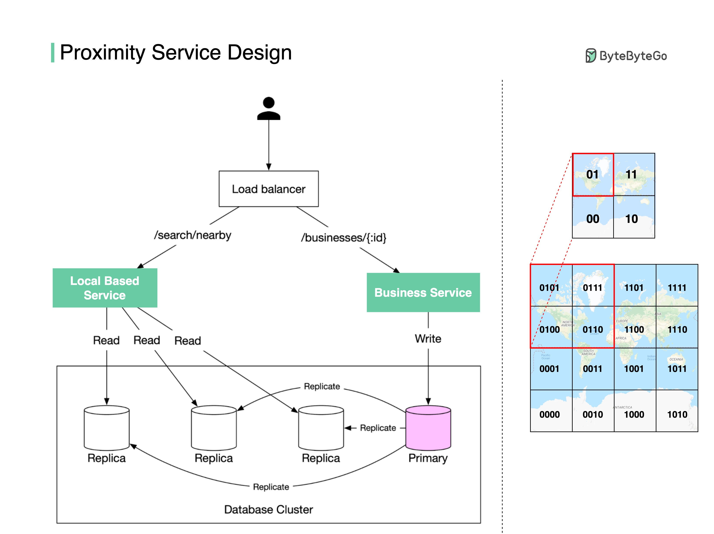

# Proximity Service

## Goals

- System Design Interview 2권의 Proximity Service를 일주일 이내에 구현하기

## Tech Stack

- Backend: Kotlin + Spring Boot
- DB: PostgreSQL + PostGIS
- Infrastructure: AWS Fargate
- IaC: Pulumi
- Cache: Redis (Optional)
- Frontend: Thymeleaf or Next.js (Optional)

## 핵심 서비스들

- LBS(Location-Based Service): 위치 기반으로 주변 검색
  - 0.5km, 1km, 2km, 5km, 20km 반경으로 검색 가능
  - `GET /search/nearby`
    - 인자: `latitude` `longitude` `radius`
- 사업장 서비스: 장소 CRUD
  - 사업장들은 클라이밍 암장들로 구성
  - `GET /places/:id`
  - `POST /places`
  - `PUT /places/:id`
  - `DELETE /places/:id`

### 컴포넌트 구성 방식

## 제외 사항

- 실시간 위치 업데이트

## 유의 사항

- 기반 서비스들을 로컬에서도 확인할 수 있고, 클라우드 상에서도 확인할 수 있어야 함
  - 환경별 Docker 프로필 구분이 필요해질 것
